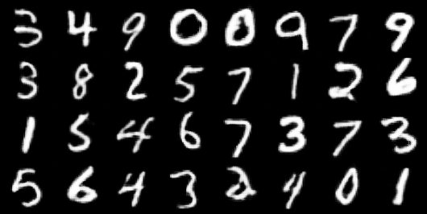
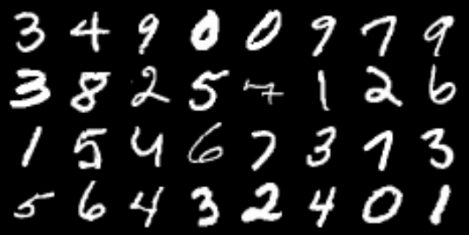

# conditional-GAN-pytorch
This repo is a pytorch implementation of 
[Conditional Generative Adversarial Nets (cGAN)](https://arxiv.org/abs/1411.1784) on MNISt dataset

GANs, also known as Generative Adversarial Networks, are one of the most fascinating new developments in deep learning.
Yann LeCun saw GANs as "the most fascinating idea in the last 10 years in ML" when Ian Goodfellow and Yoshua Bengio from the University of Montreal first unveiled them in 2014.
GANS are frequently used to make deep fake films, improve the quality of images, face swap, design gaming characters, and much more. 

In cGANs, a conditional setting is applied, meaning that both the generator and discriminator are conditioned on some sort of auxiliary information (such as class labels or data) from other modalities. As a result, the ideal model can learn multi-modal mapping from inputs to outputs by being fed with different contextual information.
# Setup and Generate
This code is developed under following library dependencies
```commandline
python 3.8
torch 1.12.0
torchvision 0.13.0
```
Start with creating a virtual environment then open your terminal and follow the following steps:
```commandline
git clone "https://github.com/zaghlol94/conditional-GAN-pytorch"
cd conditional-GAN-pytorch
pip install -r requirements.txt
bash download_assets.sh
cd src
python generate.py -n [number] ex:- python generate.py -n 0
```
# Training
```commandline
cd src
python train.py
```
after training, you could see the results of fake images in every step in tensorboard
```
tensorboard --logdir=logs/ 
```
# Results
## Results after 5 epochs:
### Fake


### Real


# Citation
```commandline
@misc{https://doi.org/10.48550/arxiv.1411.1784,
  doi = {10.48550/ARXIV.1411.1784},
  
  url = {https://arxiv.org/abs/1411.1784},
  
  author = {Mirza, Mehdi and Osindero, Simon},
  
  keywords = {Machine Learning (cs.LG), Artificial Intelligence (cs.AI), Computer Vision and Pattern Recognition (cs.CV), Machine Learning (stat.ML), FOS: Computer and information sciences, FOS: Computer and information sciences},
  
  title = {Conditional Generative Adversarial Nets},
  
  publisher = {arXiv},
  
  year = {2014},
  
  copyright = {arXiv.org perpetual, non-exclusive license}
}
```